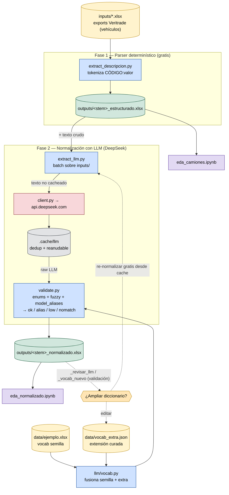

# veritrade-imports

Pipeline para **estructurar y normalizar** el campo de texto libre *"Descripción Comercial"* de exports de **Veritrade** (importaciones de vehículos, p. ej. partida `8704229000` — camiones diésel) y convertirlo en una tabla limpia, lista para análisis.

Dos fases:

1. **Parser determinístico** (gratis, sin red) — descompone la descripción (`CÓDIGO:valor`) en ~28 columnas tipadas.
2. **Normalización con LLM** (DeepSeek) — mapea marca, modelo y atributos contra un **vocabulario controlado**, con flags de confianza para revisión.

> **Datos:** los `.xlsx` provienen de **Veritrade** (proveedor de inteligencia comercial de aduanas). Los archivos de `inputs/`, `outputs/` y `data/ejemplo.xlsx` se incluyen **como ejemplo demostrativo**.
> **Uso de IA:** la fase 2 usa un modelo generativo (DeepSeek); las columnas normalizadas (`marca_norm`, `modelo_match`, `*_norm`) están marcadas con la columna `fuente` y deben validarse antes de usarse en decisiones.

## Estructura

```
inputs/        exports crudos de Veritrade (vehículos) — se procesan en batch
outputs/       generados: <stem>_estructurado.xlsx y <stem>_normalizado.xlsx
data/
  ejemplo.xlsx       vocabulario controlado (semilla: 188 marcas + enums)
  vocab_extra.json   extensión curada (marcas nuevas, alias, alias de modelo)
scripts/
  extract_descripcion.py   Fase 1 (parser determinístico, batch)
  extract_llm.py           Fase 2 (normalización LLM, batch)
  llm/                     vocab · schema · client · validate · cache · sampler · report
notebooks/     EDA: eda_camiones.ipynb (crudo) y eda_normalizado.ipynb (normalizado)
docs/flujo.mmd diagrama del flujo
```

## Instalación

```bash
pip install -r requirements.txt
```

Para la fase LLM, copia `.env.example` → `.env` y pon tu clave:

```bash
cp .env.example .env
# editar .env:  DEEPSEEK_API_KEY=sk-...
```

## Uso

### Fase 1 — Parser determinístico (sin costo, sin red)

```bash
python3 scripts/extract_descripcion.py
```

Procesa **todos** los `inputs/*.xlsx` y escribe `outputs/<stem>_estructurado.xlsx` (hoja `estructurado`). Imprime un reporte de cobertura por archivo. Un solo archivo: `--input inputs/mi_export.xlsx`.

### Fase 2 — Normalización con LLM (DeepSeek)

```bash
python3 scripts/extract_llm.py            # batch sobre inputs/ (procesa completo)
python3 scripts/extract_llm.py --input inputs/mi_export.xlsx --sample 300   # prueba rápida
```

Escribe `outputs/<stem>_normalizado.xlsx` con 4 hojas: `normalizado_llm`, `_revisar_llm`, `_vocab_nuevo`, `_reporte`. Es **reanudable** (cache en `.cache/llm/`) y la cache se **comparte entre archivos** (descripciones repetidas no se re-consultan). Costo de referencia: ~US$1 por 12 k filas.

Cada fila trae `modelo_flag`:

| flag | significado |
|---|---|
| `ok` | match exacto contra el vocabulario |
| `alias` | mapeo curado/inferido (p. ej. `17.280 → ROBUST 17.280`) — revisar |
| `low` | match difuso de baja confianza — revisar |
| `nomatch` | sin match (igual conserva `modelo_raw_llm`) — revisar |

### EDA

```bash
jupyter lab notebooks/eda_normalizado.ipynb   # o eda_camiones.ipynb
```

### Curar el diccionario

Edita `data/vocab_extra.json` y vuelve a correr la Fase 2 — **re-normaliza gratis desde la cache** (sin nuevas llamadas):

```jsonc
{
  "aliases":        { "MITSUBISHI FUSO": "FUSO" },        // variantes de marca → canónica
  "marcas":         { "FORLAND": ["FD400", "F1100"] },     // marcas/modelos nuevos
  "model_aliases":  { "VOLKSWAGEN": { "17.280 LR MAN E5": "ROBUST 17.280" } }  // modelo → canónico
}
```

Las marcas fuera del vocabulario aparecen en la hoja `_vocab_nuevo` (candidatas a agregar).

## Adaptarlo a otros archivos / partidas

El **formato Veritrade** es el mismo para cualquier export, así que la Fase 1 asume:

- Banner en las **filas 1–5**, **cabecera en la fila 6**, datos desde la 7.
- Columnas "duras" mapeadas en `HARD_COLS` y el campo libre **`Descripcion Comercial`**.

Para nuevos exports **de vehículos** (otras partidas 8701–8704, países o períodos): déjalos en `inputs/` y corre el batch — comparten el mismo diccionario de códigos y vocabulario.

Si una partida vehicular trae **códigos nuevos** en la descripción, amplía el diccionario `CODES` en `scripts/extract_descripcion.py` (mapea `CÓDIGO → (columna, tipo)`). El vocabulario de marcas/modelos se cura en `data/ejemplo.xlsx` (semilla) + `data/vocab_extra.json` (extensión).

> Para partidas **no vehiculares**, el diccionario de códigos y el vocabulario son específicos del dominio y quedan fuera del alcance de este ejemplo.

## Flujo



## Notas

- **No** subas tu `.env` (está en `.gitignore`). Cualquier `.xlsx` fuera de los ejemplos nombrados también se ignora, para no publicar data privada por accidente.
- El seguimiento de tareas usa [beads](https://github.com/steveyegge/beads) (`bd`); ver `AGENTS.md`.
